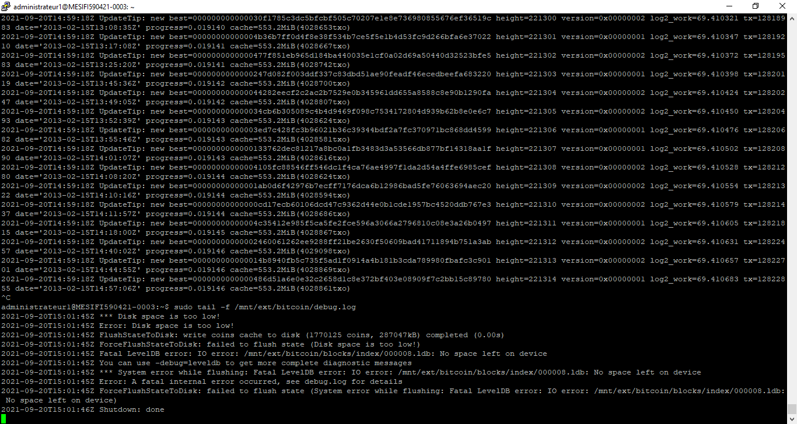
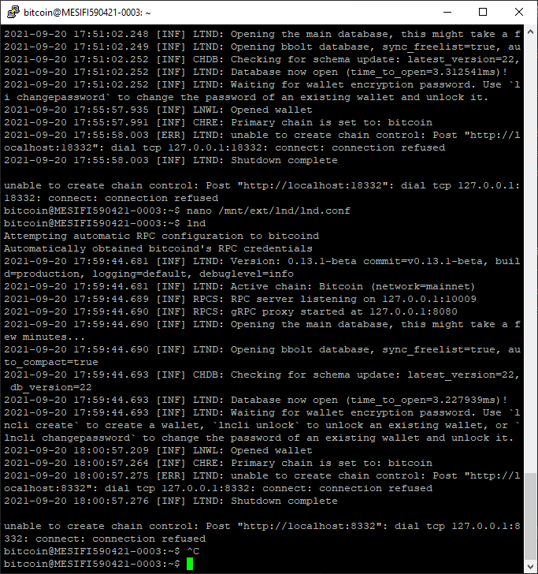

# TD 1 Monnaie Numérique

## Setting up SSH properly

Dans un premier temps on crée une clé publique et un clé privée RSA sur notre machine avec les outils Putty (dans le cas d'une machine sous windows).


On stocke ensuite les clés privée et publique dans deux fichiers différents sur l'emplacement de notre choix. On pensera à bien sécuriser le fichier contenant la clé privée, qui est l'information sensible.


On créer ensuite un dossier caché `.ssh` à la racine de la machine virtuelle. Dans ce dossier on crée un fichier `authorized_keys` dans lequel on colle la clé ssh. Une fois ce dossier sécurisé avec la commande `chmod -R 700 .ssh/` on peut se connecter via ssh depuis Putty en indiquant l'emplacement de la clé ssh sur notre machine physique.

Il est également possible de désactivé la connexion via mot de passe sur la machine virtuelle pour n'utiliser que la connexion via ssh sur la machine virtuelle. Il faut être prudent en réalisant cette opération et s'assurer que la connexion par ssh fonctionne bien avant de désactiver la connexion par mot de passe.

## Setting up UFW and Fail2Ban 

### UFW 

Pour installer UFW (uncomplicated firewall) nous avons suivi les comandes suivantes: 


### Fail2Ban

Fail2ban permet de contrer les attaques par forces brute en bloquant les tentatives de connexion après un certain nombre tentatives de connexions avec un mot de passe éronné.
L'installation de fail2Ban se fait facilement avec la commande `sudo apt install fail2ban`, puis en utilisant la configuration par défault de fail2ban.

## Installing Bitcoind 

Lors de l'installation de BitcoinD il est préférable de vérifier la checksum des fichiers téléchargé pour vérifier l'intégrité de ce que l'on vient de télécharger, mais étant donné que nous utilisons une vm pour quelques jours seulement et sans y mettre d'argent réel, nous avons passé cette étape de sécurité.

Là encore pour encore pour l'installation nous avons tout simplement suivis les commandes du tutoriel donné, cependant au lieu de sélectionner la version ARM 21.1 de Bitcoin Core nous avons pris la version 22.0 Linux (https://bitcoincore.org/bin/bitcoin-core-22.0/bitcoin-22.0-x86_64-linux-gnu.tar.gz) étant donné que l'ARM est supporté par la Raspberry.

## Turning BitcoinD into a service

Une fois BitcoinD installé changer d'utilisateur ```sudo - su bitcoin``` (crée préalablement) et crée le fichier de configuration. Pour lancer BitcoinD en testnet écrire dans la console ```bitcoind -testnet```, une connexion s'effectue puis les blocs sont synchronisés. Toutefois on souhaiterais que bitcoind se lance automatiquement au démarrage, on crée alors le fichier *bitcoind.service* et on effectue un léger changement pour lancer en testnet.

```
...
ExecStart=/usr/local/bin/bitcoind -testnet \ 
                                  -daemon \
                                  -pid=/run/bitcoind/bitcoind.pid \
                                  -conf=/mnt/ext/bitcoin/bitcoin.conf \
                                  -datadir=/mnt/ext/bitcoin
...
```

La version testnet ne se lançant pas correctement, on retire alors ce paramètre et on active le service. La prochaine fois au redémarrage on peut vérifier que le service s'est bien éxécuter en daemon avec ```systemctl status bitcoind.service``` et surveiller l'avancement avec ```sudo tail -f /mnt/ext/bitcoin/debug.log```



Malheureusement à nouveau après quelques minutes une erreur *'Disk space is too low'* intervient et il est impossible de continuer.

Nous tenterons tout de même d'avancer le plus possible mais sans les noeuds installés nous seront limités en tâches.

## Creating a wallet and depositing tBTC in it 

Nous avons essayé différent manières de créer un wallet electrum sur la machine virtuelle mais sans succès.

### Via Rust

Nous avons essayer de créer un wallet Electrum comme sur le tutoriel, mais sans succès. Le tutorielle proposait d'installer premièrement Rust en utilisant le code source,ce que nous avons éssayé mais que nous avons pas réussi. Etant donné que nous travaillons pas éxactement sur le même environnement nous avons choisi à la place d'installer Rust avec la commande `sudo apt install rustc`, ce qui a fonctionné. En revanche nous ne sommes pas parvenu à intsaller Electr et nous n'avons donc pas pu installer le server Electrum pour pouvoir y connecter de Wallet Electrum.

### Via Python 

Nous avons ensuite tenté d'installer Electrum en passant par python mais également sans succès.

## Installing LND

Pour cette étape nous n'avons rien fais de particulier à part suivre le tutoriel, seulement le fichier récupéré est le suivant *'lnd-linux-amd64-v0.13.1-beta.tar.gz'* et non l'ARM pour les même raison que précedemment.

```
$ cd /tmp
$ wget https://github.com/lightningnetwork/lnd/releases/download/v0.13.1-beta/lnd-linux-amd64-v0.13.1-beta.tar.gz
$ wget https://github.com/lightningnetwork/lnd/releases/download/v0.13.1-beta/manifest-v0.13.1-beta.txt
$ wget https://github.com/lightningnetwork/lnd/releases/download/v0.13.1-beta/manifest-roasbeef-v0.13.1-beta.sig
$ wget -O roasbeef.asc https://keybase.io/roasbeef/pgp_keys.asc

$ sha256sum --check manifest-v0.13.1-beta.txt --ignore-missing
> lnd-linux-armv7-v0.13.1-beta.tar.gz: OK

$ gpg ./roasbeef.asc
> pub rsa4096 2019-10-13 [C] E4D85299674B2D31FAA1892E372CBD7633C61696
> uid Olaoluwa Osuntokun <laolu32@gmail.com>

$ gpg --import ./roasbeef.asc
$ gpg --verify manifest-roasbeef-v0.13.1-beta.sig manifest-v0.13.1-beta.txt
>gpg: Signature made Mon 19 Jul 2021 22:41:37 BST
>gpg:                using RSA key 60A1FA7DA5BFF08BDCBBE7903BBD59E99B280306
>gpg: Good signature from "Olaoluwa Osuntokun <laolu32@gmail.com>" [unknown]
>gpg: WARNING: This key is not certified with a trusted signature!
>gpg:          There is no indication that the signature belongs to the owner.
>Primary key fingerprint: E4D8 5299 674B 2D31 FAA1  892E 372C BD76 33C6 1696
>     Subkey fingerprint: 60A1 FA7D A5BF F08B DCBB  E790 3BBD 59E9 9B28 0306

$ tar -xzf lnd-linux-armv7-v0.13.1-beta.tar.gz
$ sudo install -m 0755 -o root -g root -t /usr/local/bin lnd-linux-armv7-v0.13.1-beta/*
$ lnd --version
> lnd version 0.13.1 commit=v0.13.1-beta
```

## Turning LND into a service

Après avoir suivi toutes les étapes et crée le fichier *'lnd.conf'* lancer LND. Dans l'attente et pour pouvoir continuer on doit ouvrir une nouvelle console et créer un wallet avec ```lncli create```, on entrer notre mot de passe et demande à générer une seed que l'on prend bien soin de noter. C'est à ce moment la que l'on reçoit une erreur *'unable to create chain control'* qui nous empêche d'aller plus loin (probablement lié au fait que les noeuds ne soit pas dans la machine) :



## Opening a lightning channel

## Setting up Tor

Préalablement avant de lancer les installations et faire tourner les noeuds bitcoin et lightning on souhaiterais faire tourner Tor sur notre machine afin d'éviter d'afficher à tout le monde notre adresse ip réelle. Tor nous permet en effet de faire cela en passant par une liste de noeuds Tor dont le chemin est aléatoire et chaque noeud ne peut connaitre que le noeud précédent et le suivant mais pas toute la route.

L'installation de Tor est assez simple, on commence par écrire les lignes nécessaires dans le fichier *sources.list*, on vérifie par la suite l'intégrité des fichiers Tor en téléchargeant et ajoutant la clé signé du projet Tor

```
$ sudo nano /etc/apt/sources.list
```

```
deb https://deb.torproject.org/torproject.org buster main
deb-src https://deb.torproject.org/torproject.org buster main
```

```
$ sudo apt install dirmngr apt-transport-https
$ curl https://deb.torproject.org/torproject.org/A3C4F0F979CAA22CDBA8F512EE8CBC9E886DDD89.asc | gpg --import
$ gpg --export A3C4F0F979CAA22CDBA8F512EE8CBC9E886DDD89 | sudo apt-key add -
```

On peut enfin installer la dernière version de Tor.

Puis ne devons nous assurer que l'utilisateur "bitcoin" appartient bien au groupe "debian-tor".

```
$ sudo adduser bitcoin debian-tor
$ cat /etc/group | grep debian-tor
```

Avant de redémarrer Tor pour appliquer les modifications on modifie un fichier de configuration ``sudo nano /etc/tor/torrc`` en ajoutant les lignes suivantes.

```
# à décommenter:
ControlPort 9051
CookieAuthentication 1

# à ajouter:
CookieAuthFileGroupReadable 1
```

## Running your own BTC explorer
