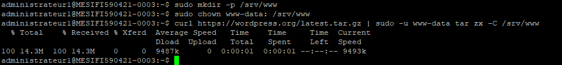

# TD 2 Monaie Numerique

## Install all dependencies

``sudo apt install ufw``

``sudo apt install fail2ban``

``sudo apt install iptables-persistent``

``sudo apt install postgresql postgresql-contrib``

``sudo apt install tor``

``sudo apt install nginx``

``sudo apt install certbot python3-certbot-nginx``

``sudo apt install build-essential libtool autotools-dev automake pkg-config bsdmainutils python3``

``sudo apt install libevent-dev libboost-system-dev libboost-filesystem-dev libboost-test-dev libboost-thread-dev libminiupnpc-dev libzmq3-dev``

``sudo apt install apache2 ghostscript libapache2-mod-php mysql-server php php-bcmath php-curl php-imagick php-intl php-json php-mbstring php-mysql php-xml php-zip``

## Adapt UFW config

En suivant le tutoriel, nous avons ajouté dans la config UFW la liste des ports qui étaient dans le tutoriel enregistré dans `iptable.txt` avec la commande ``ufw allow <port number> comment 'comment'``.


## Adapt SSH config

## NGINX

Après avoir ajouté et modifié le fichier de configuration nginx en ajoutant notre nom de domaine il se peut qu'au moment de vouloir relancer le système une erreur survient :


Pour résoudre ce problème et si ``sudo journalctl -xe --unit nginx`` ne fonctionne pas non plus, rien de compliqué il suffit d'arrêter le process ``sudo pkill -f nginx & wait $!`` et de le relancer avec start.


## Bitcoin Daemon

On continue de suivre le tutoriel mais en selectionnant la version *bitcoin-core-22.0*.

En voulant générer les fichiers make avant de build on reçoit l'erreur suivante que l'on peut corriger en installant la librairie **libdb++-dev**.


En relançant la commande "**make**" on rencontre cette fois encore une erreur :


Cette fois le package *db_cxx* n'est pas trouvé, on tente donc de l'installer d'une autre manière.

```shell
wget http://download.oracle.com/berkeley-db/db-4.8.30.zip
unzip db-4.8.30.zip
cd db-4.8.30
cd build_unix/
../dist/configure --prefix=/usr/local --enable-cxx
make
sudo make install
```

Cette fois **make** semble aller au bout sans encombre, de même pour "**sudo make install**".

On fais tourner bitcoind avec la commande ``bitcoind -testnet -daemon`` et on peut vérifier que les derniers blocs continuent d'être chargés à la date du 29/09/2021 à 15h34.


## Install BTC Pay server

Pour installer BTCpay server on commence tout d'abord par récupèrer le code source depuis github, code source que l'on clone dans un dossier `source`.
Puis on lance le script contenu dans le fichier `build.sh`.

```shell
cd ~/source
git clone https://github.com/btcpayserver/btcpayserver.git
cd btcpayserver
./build.sh
```

Nous avons décidé de ne pas utiliser postgresql comme porposé dans le tutoriel, mais d'utiliser à la place SQLite qui est la base de donnée utilisée par défaut par BTCPay server, pour une question de simplicité.

On vérifie ensuite que tout fonctionne avec la commande :

```shell
sudo journalctl -xe --unit btcpay --follow
```

et on obtient :


## Configure your BTC pay server

## Install website / Wordpress

On commence par installer les dépendances puis il suffit de 3 lignes pour installer wordpress en un instant.



On suit à la lettre les étapes **5.** et **6.** du [tutoriel](https://ubuntu.com/tutorials/install-and-configure-wordpress#1-overview), toutefois pour ce qui est de Apache nous allons plutot adapter les configurations pour utiliser NGINX installé plus tôt.

De ce fait pour installer wordpress avec NGINX nous avons suivi le tutoriel suivant : https://spinupwp.com/hosting-wordpress-yourself-nginx-php-mysql/ .
Ce tutoriel que nous avons suivi liste les choses à faire pour configurer correctement NGINX avec les dépendances nécéssaires à installer pour que tout fonctionne. Puis explique comment configurer NGINX avec wordpress.

## Create a button to pay with tBTC

## Create a button to pay with lightning

